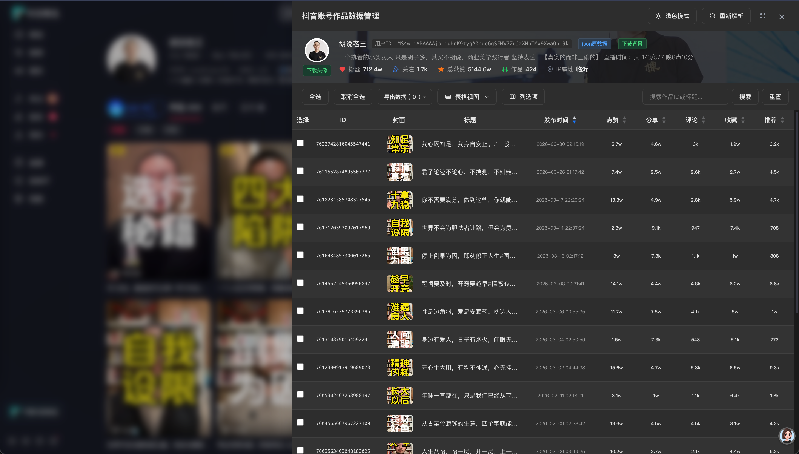
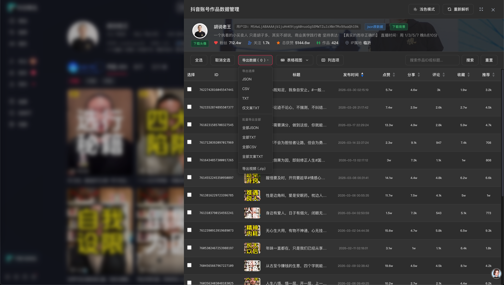

# 抖音账号作品数据管理工具

**版本：v1.1**  
**适用环境：Chrome 浏览器控制台（F12 → Console）**  
**作者：hankin**  
**最后更新：2026-06-21**

---

## 功能简介

在抖音用户主页，通过 Chrome 开发者工具控制台注入此脚本，可获取该用户所有公开作品的结构化数据，并在页面侧边栏中以表格/网格形式展示、搜索、筛选、排序、预览，并支持导出为 JSON / CSV / TXT / 视频 ZIP 四种格式。

---

## 使用方法

1. 打开 Chrome 浏览器，访问抖音用户主页，例如：
   ```
   https://www.douyin.com/user/MS4wLjABAAAAjb1juHnK9tygA0nuoGgSEMW7ZuJzXNnTMx9XwaQh19k
   ```
2. 按 `F12` 打开开发者工具，切换到 **Console（控制台）** 标签
3. 将 `fetch_dy_user_profile.js` 的完整代码复制粘贴到控制台，按回车执行
4. 页面右侧会出现一个侧边抽屉面板，所有功能均在面板内操作

> ⚠️ 必须使用**登录状态下的抖音账号**访问，否则无法获取完整数据。

---

## 功能详细说明

### 1. 用户信息展示

面板顶部展示当前用户的核心信息：

- 头像、昵称、抖音号（unique_id）
- 签名、IP 属地
- 粉丝数、关注数、作品数、获赞总数
- 作品数在数据拉取完成后会自动更新为实际加载数（与底部列表总数一致）

### 2. 主题切换）

面板右上角提供 **浅色 / 深色** 主题切换按钮，切换后自动记忆偏好（localStorage），下次打开时自动应用。

### 3. 视图切换

支持两种视图模式，通过工具栏「列选项」下拉菜单中的视图选项切换：

| 视图 | 说明 |
|------|------|
| **表格视图** | 传统行列表格，适合查看详细数据和排序 |
| **网格视图** | 卡片式封面网格，适合快速浏览作品封面 |

视图偏好自动记忆，下次打开时恢复。

### 4. 搜索过滤

工具栏提供搜索框，支持按 **作品 ID** 或 **标题关键词** 实时过滤，输入后点击按钮或按回车执行搜索，点击「重置」清除搜索条件。

### 5. 列选项

点击工具栏「列选项」按钮，可自定义表格中显示的列，勾选/取消勾选即可实时生效。

默认显示的列：序号、封面、标题、时间、点赞、分享、评论、收藏、推广、操作  
默认隐藏的列：**类型、作者**（可在列选项中勾选显示）

### 6. 排序

表格视图下，点击表头含排序箭头的列（时间、点赞、分享、评论、收藏、推广），即可按该字段排序，再次点击切换升序/降序。

### 7. 封面预览

- **视频作品**：点击封面图，弹出全屏视频播放弹窗，自动播放
- **图文作品**：点击封面图，弹出全屏图片幻灯片，支持：
  - 左右箭头切换图片
  - 底部圆点指示器，点击跳转
  - 左上角显示 `当前图 / 总图数`
  - 自动播放该作品关联的背景音乐
  - 键盘 ← → 切换，ESC 关闭

### 8. 分页

表格和网格视图均支持分页，每页 20 条，可通过底部分页控件跳转。

### 9. 全选 / 取消全选

工具栏提供「全选」「取消全选」按钮，方便批量操作。

### 10. 导出数据

选中作品后（勾选复选框），点击工具栏「导出选中 (N) ▾」，选择导出格式：

| 格式 | 说明 |
|------|------|
| **JSON** | 结构化数据，含完整用户信息、导出时间、作品列表（含视频地址、播放地址、各项统计数据） |
| **CSV** | 逗号分隔表格，UTF-8 BOM 编码，Excel / WPS 直接打开不乱码 |
| **TXT** | 纯文本格式，用户信息 + 每条作品详细数据，适合阅读 |
| **视频 ZIP** | 批量下载选中视频的原文件，打包为 ZIP 压缩包 |

导出文件命名格式：`抖音作品_昵称_选中数据.后缀`（视频 ZIP 为 `抖音视频_昵称_日期.zip`）

#### 导出内容说明

**JSON 格式**：
```json
{
  "user_info": {
    "nickname": "昵称",
    "unique_id": "抖音号",
    "sec_uid": "...",
    "signature": "签名",
    "avatar": "头像链接",
    "ip_location": "IP属地",
    "region": "地区",
    "follower_count": 粉丝数,
    "following_count": 关注数,
    "aweme_count": 作品数,
    "total_favorited": 获赞总数,
    "page_url": "当前页面链接"
  },
  "export_time": "导出时间",
  "select_total": 选中数,
  "list": [ ... 作品详情 ... ]
}
```

**TXT 格式**：文件头部包含完整用户信息和页面链接，每条作品以分隔线隔开，键值对缩进对齐。

#### 视频导出（ZIP）

选中视频作品后，选择「导出视频 (.zip)」，脚本会自动下载所有选中视频并打包为一个 ZIP 文件。

- **文件命名**：ZIP 内每个视频为 `作品ID_标题.mp4`
- **ZIP 命名**：`抖音视频_昵称_2026-06-21.zip`
- **仅限视频**：图文类型作品自动跳过，仅导出视频
- **压缩策略**：`level:0` 不压缩（视频本身已压缩，再压缩无意义且浪费时间）
- **进度展示**：全屏进度浮层，支持中途取消
- **下载失败**：单个视频失败不影响其他视频，最终弹窗汇总成功/失败数

**下载策略（四级降级）**：

抖音视频地址存在 CORS 限制和重定向问题，脚本采用四级降级策略确保最大化下载成功率：

```
① HEAD play_addr (同源) → 读到 Location 头 → 拿到真实 CDN 地址
② 匿名 fetch CDN 地址 (credentials: omit, 不带 cookie) → CDN 通常允许匿名 CORS ✅
③ 匿名还是 opaque → 再试带 cookie 的 fetch
④ 仍失败 → 回退新标签页
```

| 步骤 | 操作 | 说明 |
|------|------|------|
| ① HEAD 重定向 | `fetch(url, { method: "HEAD", redirect: "manual" })` | 抖音 play_addr 是同源重定向地址，HEAD 请求读取 301/302 的 Location 头拿到真实 CDN URL |
| ② 匿名 fetch | `fetch(cdnUrl, { credentials: "omit" })` | 不带 cookie 请求 CDN，CDN 通常允许匿名 CORS，避免 cookie 导致的拒绝 |
| ③ 带 cookie fetch | `fetch(cdnUrl, { credentials: "include" })` | 匿名失败时尝试带 cookie 再试 |
| ④ 多候选地址 | play_addr → bit_rate → download_addr | 依次尝试所有候选地址，全部失败才跳过该视频 |

**打包流程**：

```
阶段 1（0% → 75%）：逐个视频调用 fetchVideoBlob() 收集到内存
阶段 2（75% → 100%）：fflate.zipSync() 打包为 ZIP → 触发下载
```

**依赖库**：

- **fflate**（`v0.8.2`）：流式 ZIP 打包库，通过动态 `<script>` 标签加载 UMD 版本，无需构建工具
  ```html
  <script src="https://cdn.jsdelivr.net/npm/fflate@0.8.2/umd/index.js"></script>
  ```

### 11. 查看原始 JSON

每行操作列的「JSON」按钮，可查看该作品的原始 API 返回数据，方便调试和二次开发。

### 12. 删除作品（本地）

每行操作列的「删除」按钮，可从本地列表中移除该作品（仅影响当前浏览，不影响抖音服务器数据）。

---

## 技术说明

### 第三方依赖

| 库 | 版本 | 用途 | 加载方式 |
|-----|------|------|---------|
| [Tailwind CSS](https://tailwindcss.com) | CDN | UI 样式框架 | 动态 `<script>` 标签 |
| [fflate](https://github.com/101arrowz/fflate) | 0.8.2 | ZIP 打包（视频导出） | 动态 `<script>` 标签（UMD） |

### 数据来源

脚本通过拦截/调用抖音 Web 端 API 获取数据：

| API 接口 | 用途 |
|-----------|------|
| `/aweme/v1/web/user/profile/other/` | 获取用户基本信息 |
| `/aweme/v1/web/aweme/post` | 分页获取用户作品列表 |

### sec_uid 动态提取

脚本自动从当前页面 URL 中动态提取 `sec_uid`，无需手动配置，兼容各种格式的抖音用户链接。

### 翻页策略

- 每次请求 `count=35`（减少请求次数）
- 根据 `has_more` 判断是否继续翻页
- 空页（接口抖动）不立即退出，允许最多连续 3 页为空才停止
- `max_cursor` 不变时自动停止，防止死循环
- 拉取过程中显示进度条

### 图片幻灯片

图文作品的多张图片以幻灯片形式展示，同时自动播放该作品关联的音乐（取 `item.music.play_url.url_list[0]`）。

---

## 注意事项

1. **登录状态**：必须在登录状态下使用，否则 API 返回数据不完整
2. **私密/已删除作品**：`aweme_count` 包含私密和已删除作品，实际能拉取的数量可能少于显示的总数，属于正常现象
3. **频率限制**：抖音有接口频率限制，脚本已设置每次请求间隔 800ms，如遇拉取中断，可重新执行脚本
4. **仅限个人使用**：本脚本仅供个人数据备份和学习研究使用，请勿用于商业目的或违规行为
5. **IP 属地字段**：抖音 API 返回字段名可能变化，脚本已做多字段兜底（`ip_location` / `ip_attr` / `region` / `address` / `city`）

---

## 更新日志

### v1.1（2026-06-21）

- ✅ 新增「导出视频 (.zip)」功能，批量下载选中视频并打包为 ZIP
- ✅ 视频下载四级降级策略：HEAD 重定向 → 匿名 fetch CDN → 带 cookie fetch → 候选地址兜底
- ✅ 引入 fflate 流式 ZIP 打包库（level:0 不压缩）
- ✅ 视图切换改为下拉菜单样式（与列选项一致）
- ✅ 导出按钮统一为下拉合并样式

### v1.0（2026-06-19）

- ✅ 初始版本发布
- ✅ 支持表格/网格双视图
- ✅ 支持 JSON / CSV / TXT 三格式导出
- ✅ 支持图文幻灯片 + 背景音乐
- ✅ 支持视频弹窗播放
- ✅ 支持搜索、排序、列选项
- ✅ 支持浅色/深色主题
- ✅ 修复翻页空页提前退出的 bug
- ✅ 修复作品总数不一致的 bug
- ✅ 修复 IP 属地获取不到的 bug
- ✅ 导出 TXT/JSON 包含完整用户信息和页面链接
- ✅ 添加完整代码注释（JSDoc）

---

## 文件结构

```
/
└── fetch_dy_user_profile.js   # 主脚本文件（约 2300 行）
```

## 功能展示





## 扫码进微信群


---

## License

MIT License — 仅供个人学习交流使用。
